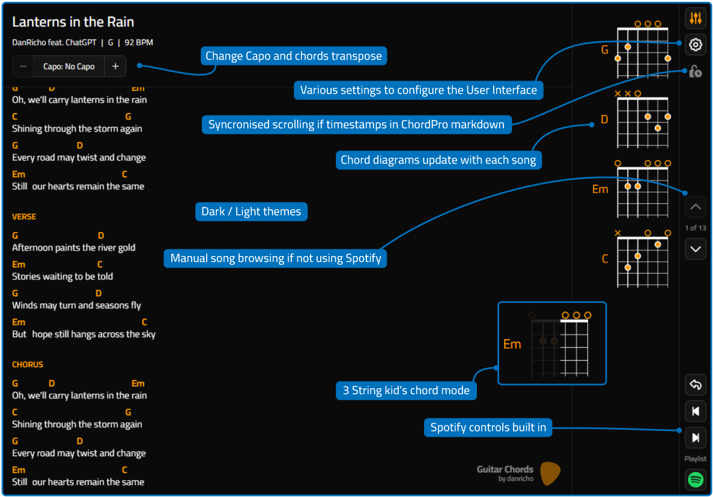

<div align="center">


# Guitar Chords

</div>

A lightweight web application for guitarists that renders ChordPro charts and synchronises them with Spotify playback.

Designed for practising with real recordings, Guitar Chords can automatically load charts, display chord diagrams, and scroll in time with the currently playing track.

## Features

- Render ChordPro charts directly in the browser.
- Spotify integration using the Spotify Web API.
- Automatic chart loading based on the currently playing Spotify track.
- Timestamp-based chart synchronisation.
- Percentage-based fallback synchronisation when timestamps are not present.
- Guitar chord diagrams displayed alongside charts.
- Chord transposition via Capo adjustment controls.
- Optional 'capo-change' song for spotify playlists.
- Dark and light themes.
- Kid-friendly three-string chord display mode.
- Responsive tablet-friendly layout.
- Local storage of user preferences.
- iOS "Add to Home Screen" support for a near full-screen experience.

## Screenshots



_Screenshots are captured at an iPad 11-inch (A16) sized viewport. More are available in the `readme-graphics` directory._

## How It Works

Charts are written in ChordPro format and manually registered with the application.

When Spotify playback changes:

1. The current track is read using the Spotify Web API.
2. The application searches for a matching chart.
3. The chart is loaded automatically.
4. Scrolling is synchronised to the current playback position.
5. Chord diagrams and song metadata are also displayed.

## Chord Transposition

Guitar Chords is designed for musicians who want to play along with recordings while using familiar chord shapes.

The capo controls alter the displayed chords without changing the perceived key.

Combined with using the capo as set, this allows players to:

- Use easier chord shapes (or those learnt while learning)
- Match the original recording.
- Play songs in alternative positions on the neck.
- Quickly experiment with different capo locations.

## Chord Diagram Library

Guitar Chords includes a lightweight built-in chord diagram library that displays fretboard positions for recognised chords found within a chart.

When a chart is loaded, any supported chords are automatically displayed alongside the lyrics to provide a quick visual reference while playing.

### Unknown Chords

If a chord appears in a chart but does not exist in the current chord library, a placeholder indicator is displayed instead of a fret diagram.

The chart itself will continue to render normally.

### Kid Mode

A simplified "Kid Mode" is available for younger players and beginners using three-stringed guitars (eg. Loog).

This mode reduces the complexity of displayed chord diagrams by presenting a simplified three-string view, making it easier to focus on essential finger placement while learning basic chord transitions.

## Built With

- HTML5
- JavaScript (ES6)
- jQuery
- Tailwind CSS
- Basecoat CSS
- ChordSheetJS
- Spotify Web API

## Setup

### Docker

The application is a static website and can be hosted by any standard web server.

The included `docker-compose.yml` demonstrates a simple self-hosted deployment using Nginx.

```bash
docker compose up -d
```

### Spotify Setup

Spotify functionality is optional.

If no Spotify Client ID is configured (in `web-root/static/js/spotify-settings.js`), the application will continue to function as a standalone chart viewer and the Spotify button will be hidden.

### Creating a Spotify Application

1. Visit the [Spotify Developer Dashboard](https://developer.spotify.com/dashboard).
2. Create a new application.
3. Copy the generated Client ID.
4. Configure your application's redirect URI.
5. Add the redirect URI to your Spotify application settings.

> [!NOTE]
> Spotify requires HTTPS for the redirect URI and doesn't allow localhost.

Cloudflare Tunnel works well for self-hosted installations.

### Configure Spotify Settings

Update the Spotify configuration file `web-root/static/js/spotify-settings.js`:

```javascript
const spotify_clientId = ""; // The Client ID from your Spotify Developer application.
const spotify_redirectUri = ""; // The redirect URI registered in the Spotify Developer Dashboard.
const spotify_playlist = ""; // Optional playlist url to add a link near the Spotify button.
const spotify_capo_change_song = ""; // Optional track name used to trigger the capo-change reminder screen.
```

#### spotify_clientId

### Spotify User Access

Spotify applications created in development mode can only be used by approved Spotify accounts.

To allow additional users:

1. Open your Spotify Developer application.
2. Navigate to User Management.
3. Add the Spotify account email addresses that should have access.

## Adding Charts

Charts are registered manually in `load-charts.js`.

Example:

```javascript
charts = [
  {
    // The `name` field should match the Spotify track title and artist.
    // When a matching track is detected, the chart is loaded automatically from the `path` field.
    name: "Lanterns in the Rain - DanRicho feat. ChatGPT",
    path: "../charts/Fiction-LanternsInTheRain.md",
  },
];
```

### Why Manual Registration?

Manual chart registration keeps the application compatible with static hosting environments and avoids requiring server-side file discovery.

## ChordPro Charts

Charts are stored as Markdown files using ChordPro syntax.

### Metadata

```text
{title: Lanterns in the Rain}
{artist: DanRicho feat. ChatGPT}
{capo: None}
{key: G}
{tempo: 92}
```

Supported metadata fields:

| Field  | Description             | Used for                                                    |
| ------ | ----------------------- | ----------------------------------------------------------- |
| title  | Song title              | Displayed as Title                                          |
| artist | Song artist             | Displayed as Artist                                         |
| capo   | Suggested capo position | The starting Capo setting (matches the chords in the chart) |
| key    | Song key                | The key of the song (per the recording being played)        |
| tempo  | Song tempo              | The tempo of the song                                       |

### Sections

Sections help organise charts.

```text
{sov: Verse}
...
{eov}

{soc: Chorus}
...
{eoc}
```

### Chords

Standard ChordPro chord notation is supported.

```text
[G]Morning breaks on an [D]empty street
[Em]Puddles hum beneath my [C]feet
```

### Timestamp Synchronisation

Timestamps are implemented using ChordPro comments.

```text
[G]Morning breaks on an [D]empty street {c: 00:00}
[Em]Puddles hum beneath my [C]feet {c: 00:08}
[G]Clouds drift low but I [D]feel no fear {c: 00:16}
```

When timestamps exist:

- Scrolling follows the supplied timestamps.
- Playback position is synchronised to Spotify.

When timestamps do not exist:

- Scrolling is calculated from the percentage of the chart completed.
- Playback position is calculated from the percentage of the song completed.

## Chord Definitions

Chord diagrams are defined manually within the application.

Each chord uses a six-character string representation describing the guitar strings from low E to high E: `x02220`

Where:

- `x` = muted string
- `0` = open string
- `1-9` = fret number

### Extending the Library

Additional chords can be added by extending the chord lookup table in `web-root/static/js/fretboard.js`.

## Known Limitations

- Charts must be registered manually.
- Timestamp accuracy depends on chart authoring quality.
- Spotify track naming variations may require manual chart mapping.
- Chord library is not yet exhaustive.

## Roadmap

See the `About / Roadmap` tab in the settings dialog window!

## License

Licensed under the Apache License, Version 2.0.

See `LICENSE` for the full license text.
