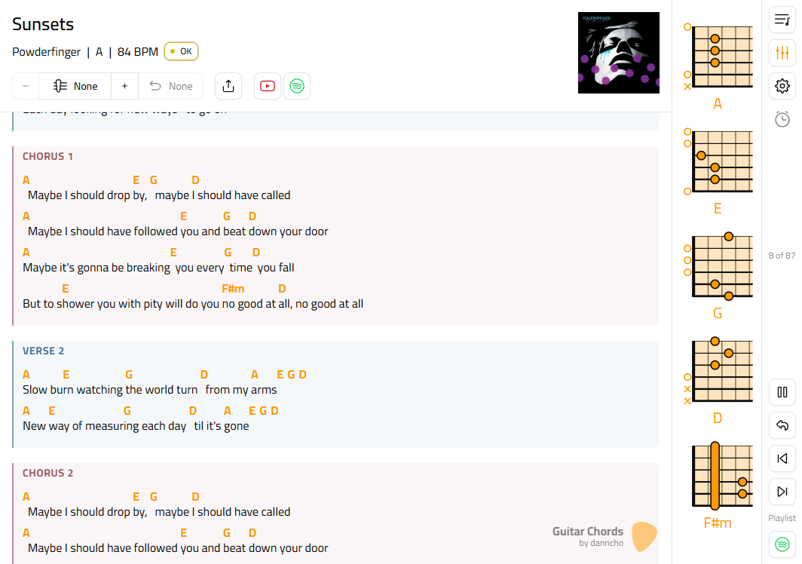
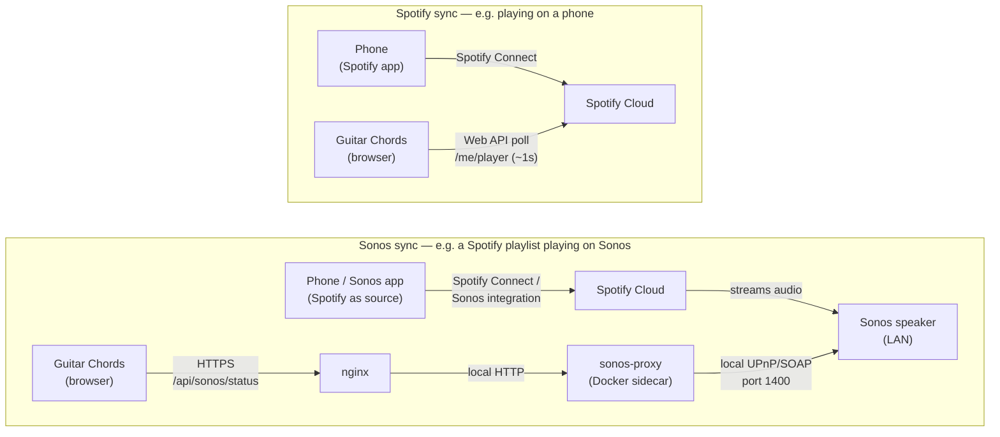

<div align="center">


# Guitar Chords

</div>

A lightweight web application for guitarists that renders ChordPro Song Charts and synchronises them with playback — via Spotify, or a local Sonos speaker.

Designed for practising with real recordings, Guitar Chords can automatically load Song Charts, display Fretboard Chord Diagrams, and scroll in time with the currently playing track.

## Features

- Render ChordPro Song Charts directly in the browser.
- Two optional, mutually exclusive sync sources — the app works fully as a standalone Song Chart viewer with neither configured:
  - **Spotify** — automatic Song Chart loading and scroll sync driven by the Spotify Web API, based on the currently playing track.
  - **Sonos (local)** — the same automatic loading and sync, driven instead by a Sonos speaker on your home network via a small local proxy — no Spotify account involved. See [Sonos Setup](#sonos-setup).
- Timestamp-based Song Chart synchronisation.
- Percentage-based fallback synchronisation when timestamps are not present.
- Fretboard Chord Diagrams displayed alongside Song Charts, including barre chords.
- Chord transposition via Capo adjustment controls.
- Colour-coded Song Chart sections: verse, chorus and bridge each get a distinct coloured left border, background tint and label.
- Traffic-light difficulty badges (easy/ok/medium/hard, set per song in the registry) shown in the Song List and next to the song info.
- Song List grouped into category tabs (Favourites / Likes / Training / Creating, set per song in the registry).
- Optional 'capo-change' track (works with either sync source), showing the next registered song and its capo setting.
- Shareable deep links: the URL carries a `?chart=<slug>` argument for the loaded Song Chart, and the page title shows the song and artist. A share button (shown only where the browser supports the Web Share API) opens the native share sheet with a "Play along to &lt;song&gt; by &lt;artist&gt; on Guitar Chords!" message and the deep link.
- Dark and light themes.
- Kid-friendly three-string chord display mode.
- Responsive tablet-friendly layout.
- Local storage of user preferences.
- iOS "Add to Home Screen" support for a near full-screen experience.

## Screenshots



## How It Works

Song Charts are written in ChordPro format and manually registered with the application.

When playback changes on whichever sync source is active (Spotify or Sonos — see [Sonos Setup](#sonos-setup)):

1. The current track is read — via the Spotify Web API, or via a local Sonos speaker.
2. The application searches for a matching Song Chart.
3. The Song Chart is loaded automatically.
4. Scrolling is synchronised to the current playback position.
5. Fretboard Chord Diagrams and song metadata are also displayed.

The two sync sources reach the currently-playing track very differently. Spotify sync talks straight to Spotify's own cloud API, wherever the phone/device playing it is. Sonos sync never talks to Spotify at all — it doesn't matter that the audio originated from Spotify, the app only ever asks the Sonos speaker itself, over the local network:



In Spotify sync, the browser is one more client talking to Spotify's cloud, same as the phone. In Sonos sync, the browser's request never leaves the local network — `sonos-proxy` exists specifically because a Sonos speaker's control API is plain HTTP, which the browser (served over HTTPS) can't call directly without triggering mixed-content blocking; see [Sonos Setup](#sonos-setup) for why.

## Chord Transposition

Guitar Chords is designed for musicians who want to play along with recordings while using familiar chord shapes.

The capo controls alter the displayed chords without changing the perceived key.

Combined with using the capo as set, this allows players to:

- Use easier chord shapes (or those learnt while learning)
- Match the original recording.
- Play songs in alternative positions on the neck.
- Quickly experiment with different capo locations.

## Fretboard Chord Diagram Library

Guitar Chords includes a lightweight built-in Fretboard Chord Diagram library that displays fretboard positions for recognised chords found within a Song Chart.

When a Song Chart is loaded, any supported chords are automatically displayed alongside the lyrics to provide a quick visual reference while playing.

### Unknown Chords

If a chord appears in a Song Chart but does not exist in the current chord library, a placeholder indicator is displayed instead of a Fretboard Chord Diagram.

The Song Chart itself will continue to render normally.

### Kid Mode

A simplified "Kid Mode" is available for younger players and beginners using three-stringed guitars (eg. Loog).

This mode reduces the complexity of displayed Fretboard Chord Diagrams by presenting a simplified three-string view, making it easier to focus on essential finger placement while learning basic chord transitions.

## Built With

- HTML5
- JavaScript (ES6)
- [jQuery](https://github.com/jquery/jquery)
- [Tailwind CSS](https://github.com/tailwindlabs/tailwindcss)
- [Basecoat](https://github.com/hunvreus/basecoat)
- [ChordSheetJS](https://github.com/martijnversluis/ChordSheetJS)
- [Spotify Web API](https://developer.spotify.com/documentation/web-api)

## Setup

### Docker

The application is a static website and can be hosted by any standard web server.

The included `docker-compose.yml` demonstrates a simple self-hosted deployment using Nginx.

```bash
docker compose up -d
```

`docker-compose.yml` also defines a `sonos-proxy` service. It's entirely optional (see [Sonos Setup](#sonos-setup)) — ignore it if you're not using Sonos sync.

### Spotify Setup

Spotify functionality is optional.

If no Spotify Client ID is configured (in `web-root/static/js/spotify-settings.js`), the application will continue to function as a standalone Song Chart viewer and the Spotify button will be hidden.

### Creating a Spotify Application

1. Visit the [Spotify Developer Dashboard](https://developer.spotify.com/dashboard).
2. Create a new application.
3. Copy the generated Client ID.
4. Configure your application's redirect URI.
5. Add the redirect URI to your Spotify application settings.

> [!NOTE]
> Spotify requires HTTPS for the redirect URI and doesn't allow localhost.

Cloudflare Tunnel works well for self-hosted installations.

### Configure Spotify Settings

Update the Spotify configuration file `web-root/static/js/spotify-settings.js`:

```javascript
window.SpotifyConfig = {
  clientId: "", // The Client ID from your Spotify Developer application.
  redirectUri: "", // The redirect URI registered in the Spotify Developer Dashboard.
  playlist: "", // (optional) Playlist URL to add a link near the Spotify button.
  capoChangeSong: "", // (optional) Track ID used to trigger the capo-change reminder screen.
};
```

### Spotify User Access

Spotify applications created in development mode can only be used by approved Spotify accounts.

To allow additional users:

1. Open your Spotify Developer application.
2. Navigate to User Management.
3. Add the Spotify account email addresses that should have access.

### Sonos Setup

Sonos sync is entirely optional and off by default — skip this whole section if you don't have a Sonos speaker, or are happy with Spotify sync (or neither). Nothing else in the app changes if it's not configured.

It works via a small local network proxy, since the app is served over HTTPS but a Sonos speaker's own control API is plain HTTP on your LAN — browsers block that combination outright, so something has to sit in between. That's the `sonos-proxy` service in `docker-compose.yml`.

To enable it:

1. Give your Sonos speaker(s) a static IP or DHCP reservation on your router (so the proxy's config doesn't go stale later).
2. Set `SONOS_SPEAKER_UPSTAIRS_IP` and/or `SONOS_SPEAKER_DOWNSTAIRS_IP` in `docker-compose.yml`'s `sonos-proxy` service to those IPs. (Yes, the names are hardcoded — see [Known Limitations](#known-limitations).)
3. `docker compose up -d` — this also starts the `sonos-proxy` service.
4. In the app, open Settings → Sync, turn on "Sonos mode", and pick a speaker.

If you don't want the `sonos-proxy` service running at all, delete that block from `docker-compose.yml` — the rest of the app is unaffected either way; the Sonos toggle in Settings just won't do anything useful without it.

## Adding Song Charts

Song Charts are registered manually in `charts/!registry.json`, under its top-level `charts` array. `charts/load-charts.js` (in `static/js/`, not the `charts/` directory) is just the loader — it fetches that JSON file synchronously and sets `window.charts`.

Example entry:

```json
{
  "spotifyMatch": "Lanterns in the Rain - DanRicho feat. AI",
  "title": "Lanterns in the Rain",
  "artist": "DanRicho feat. AI",
  "difficulty": null,
  "category": "Likes",
  "chords": ["G", "D", "Em", "C"],
  "heardKey": "G",
  "path": "../charts/Fiction-LanternsInTheRain.md",
  "defaultCapo": 0
}
```

- `spotifyMatch` should match the Spotify track title and artist — when a matching track is detected, the Song Chart loads automatically from `path`.
- `title` is shown with `artist` as "title by artist" in the heading and Song List.
- `difficulty`: `"easy"` | `"ok"` | `"medium"` | `"hard"` | `null` (shown as TBD).
- `category`: Song List tab — `"Favourites"` | `"Likes"` | `"Training"` | `"Creating"`. Missing/unset defaults to `"Creating"`.
- `chords`: unique chords as written in the chart, in order of first appearance.
- `heardKey`: concert key of the recording (what the audience hears).
- `defaultCapo`: shown as the Song Chart's capo badge in the Song List.

### Why Manual Registration?

Manual Song Chart registration keeps the application compatible with static hosting environments and avoids requiring server-side file discovery.

## ChordPro Song Charts

Song Charts are stored as Markdown files using ChordPro syntax.

### Metadata

```text
{tempo: 92}
```

Supported metadata fields:

| Field | Description | Used for              |
| ----- | ----------- | --------------------- |
| tempo | Song tempo  | The tempo of the song |

Title, artist, key and capo are not stored in the Song Chart file — they come from the registry entry in `charts/!registry.json` (`title`, `artist`, `heardKey`, `defaultCapo`). Keeping the key out of the file means capo transposition can never alter it (e.g. when copying a Song Chart out). The chords in the file must be written as played at `defaultCapo`.

### Sections

Sections help organise Song Charts. The conventions are:

- Verses use the verse environment and are numbered by order of appearance: `{start_of_verse: Verse 1}`
- Choruses use the chorus environment and are numbered the same way: `{start_of_chorus: Chorus 2}`
- Every other section (Pre-Chorus, Intro, Outro, Bridge, Solo, Interlude, Instrumental, Ending, ...) uses the bridge environment with an unnumbered label: `{start_of_bridge: Intro}` — only Verse and Chorus get numbers.

```text
{start_of_verse: Verse 1}
...
{end_of_verse}

{start_of_chorus: Chorus 1}
...
{end_of_chorus}

{start_of_bridge: Outro}
...
{end_of_bridge}
```

### Chords

Standard ChordPro chord notation is supported.

```text
[G]Morning breaks on an [D]empty street
[Em]Puddles hum beneath my [C]feet
```

### Timestamp Synchronisation

Timestamps are implemented using ChordPro comments.

```text
[G]Morning breaks on an [D]empty street {c: 00:00}
[Em]Puddles hum beneath my [C]feet {c: 00:08}
[G]Clouds drift low but I [D]feel no fear {c: 00:16}
```

When timestamps exist:

- Scrolling follows the supplied timestamps.
- Playback position is synchronised to Spotify.

When timestamps do not exist:

- Scrolling is calculated from the percentage of the Song Chart completed.
- Playback position is calculated from the percentage of the song completed.

## Chord Definitions

Fretboard Chord Diagrams are defined manually within the application in `web-root/static/js/fretboard.js`.

### Open / Non-Barre Chords

A six-character string describes the guitar strings from low E to high E:

```javascript
A: "x02220",
```

Where:

- `x` = muted string
- `0` = open string
- `1–9` = fret number

### Barre Chords

Barre chords use an object with a `strings` field (same format as above) and a `barre` descriptor:

```javascript
F:  { strings: "133211", barre: { fret: 1, from: 1, to: 6 } },
Bm: { strings: "x24432", barre: { fret: 2, from: 2, to: 6 } },
```

| Field        | Description                                             |
| ------------ | ------------------------------------------------------- |
| `strings`    | Full six-character fret spec, same as a non-barre chord |
| `barre.fret` | Fret number where the barre bar is drawn                |
| `barre.from` | First string the barre covers (1 = low E)               |
| `barre.to`   | Last string the barre covers (6 = high e)               |

The `strings` field still encodes every finger position, including the ones lying on the barre fret. The renderer uses `barre.fret`, `from`, and `to` to decide what to draw:

- A filled pill-shaped bar is drawn across strings `from`–`to` at `barre.fret`.
- Any string whose fret number in `strings` matches `barre.fret` **and** falls within `from`–`to` is treated as part of the barre — no individual dot is drawn for it.
- All other fretted positions (higher frets, or strings outside the barre range) are drawn as normal filled dots on top of the bar.

### Extending the Library

Additional chords can be added by extending `Fretboard.CHORD_LOOKUP` in `web-root/static/js/fretboard.js`.

## Known Limitations

- Song Charts must be registered manually.
- Timestamp accuracy depends on Song Chart authoring quality.
- Spotify track naming variations may require manual Song Chart mapping.
- Chord library is not yet exhaustive.
- Sonos sync supports pre configured speakers (`upstairs`/`downstairs`, configured via env vars) — not general speaker discovery

## Roadmap

See the `About / Roadmap` tab in the settings dialog window!

## License

Licensed under the Apache License, Version 2.0.

See `LICENSE` for the full license text.
